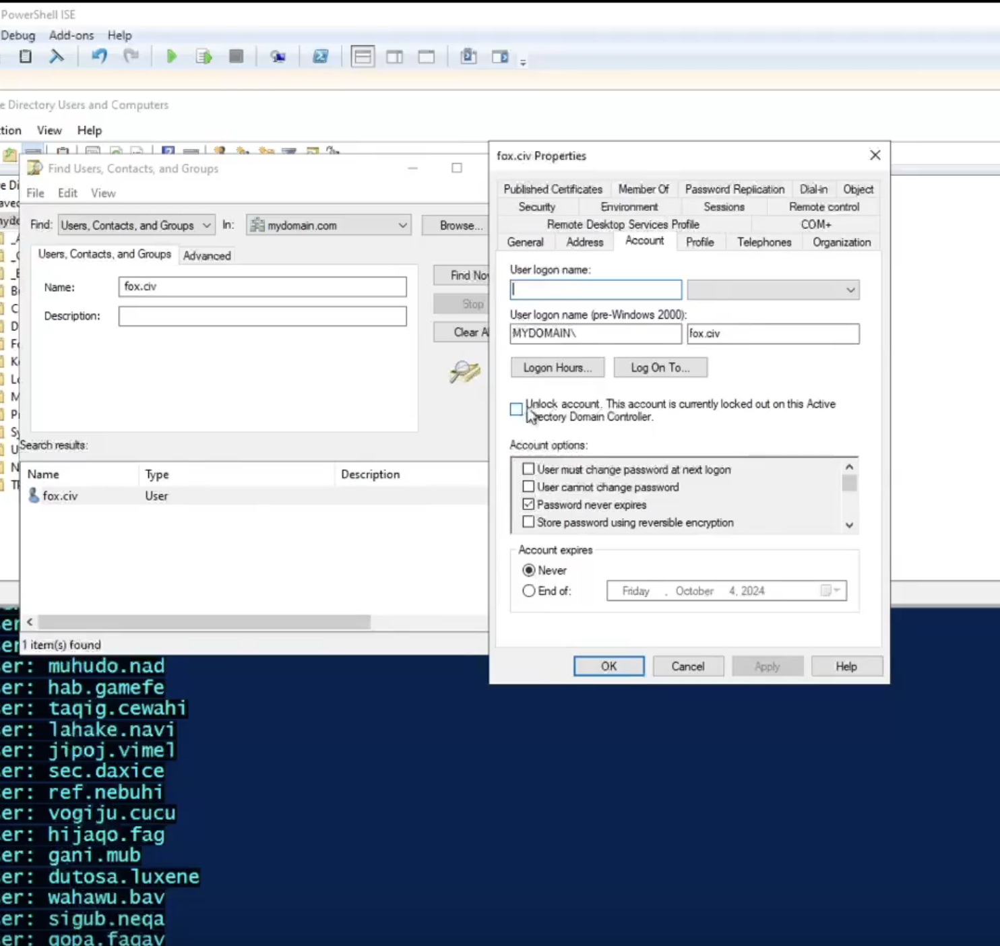
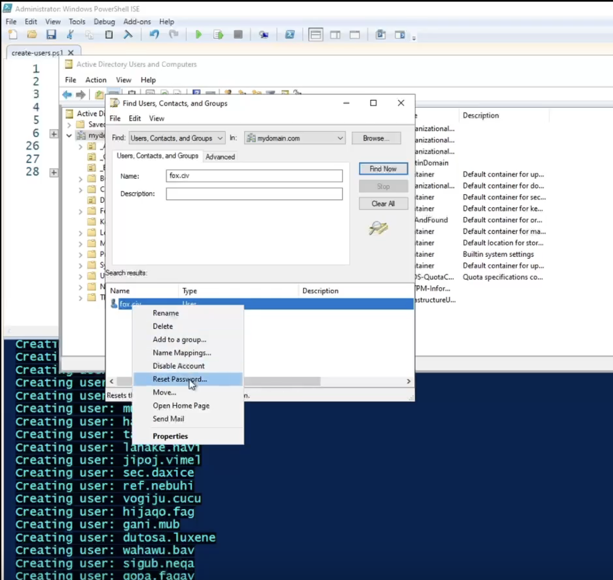
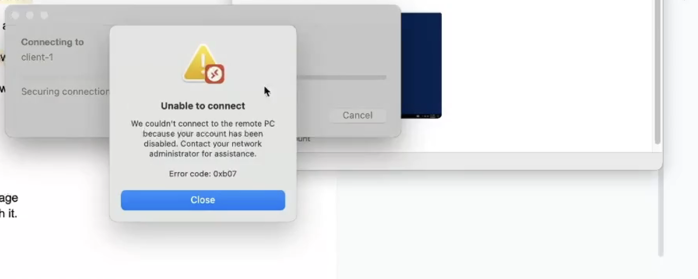
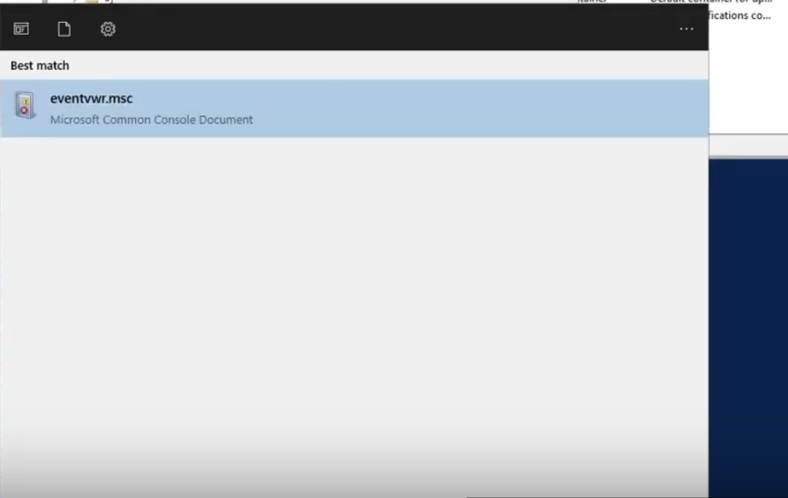
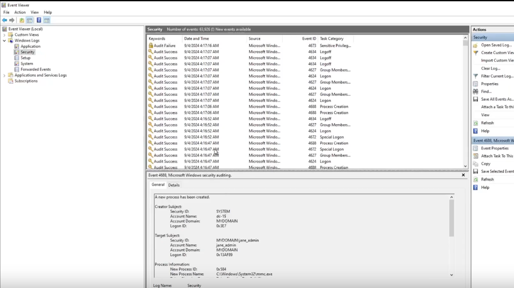

# Managing Active Directory Accounts and Account Lockouts

## Project overview

In this lab, I continue from **Part 3 — Creating Active Directory Users with PowerShell** by practicing common help desk tasks: unlocking accounts, resetting passwords, disabling and enabling accounts, and reviewing Windows security logs.

These exercises demonstrate how account status affects sign-in and how logs help investigate authentication problems.

**Scope:** This walkthrough covers account management and troubleshooting. It assumes an account lockout policy is already configured; creating or editing a Group Policy Object is not documented in this part.

## Lab environment

| Component | Name or configuration | Purpose |
| --- | --- | --- |
| Domain controller | `dc-1` | Hosts Active Directory and domain account management tools |
| Client workstation | `client-1` | Used for test sign-in attempts |
| Domain | `mydomain.com` | Contains the lab accounts |
| Administrator account | `jane_admin` | Manages the test account and reviews logs |
| Test account | A standard user created in Part 3 | Used to simulate sign-in problems |
| Management tools | ADUC and Event Viewer | Manage accounts and inspect security events |

## Before you begin

- Complete the domain setup and user creation from the previous parts.
- Confirm that the selected test account can normally sign in to `client-1`.
- Keep an administrator session available on `dc-1` to manage the test account.
- Record the test account's logon name and use the same account throughout the exercises.
- Confirm the effective account lockout policy before testing.

### How account lockout policy affects this lab

An **account lockout threshold** specifies how many failed sign-in attempts trigger a lockout. A threshold of `0` disables this type of lockout. The duration and counter reset interval also affect the test. See [Microsoft's account lockout threshold documentation](https://learn.microsoft.com/en-us/previous-versions/windows/it-pro/windows-10/security/threat-protection/security-policy-settings/account-lockout-threshold).

The original exercise calls for ten incorrect password attempts. Use ten only if it matches the policy effective for the selected account; ten attempts do not guarantee a lockout in every environment.

## 1. Simulate an account lockout

1. Connect to `dc-1` using the domain administrator account:

   ```text
   mydomain.com\jane_admin
   ```

2. Choose a standard user created in Part 3.
3. From a separate Remote Desktop connection to `client-1`, attempt to sign in as that user with an incorrect password.
4. Repeat until the configured lockout threshold is reached, then stop the attempts.
5. Return to `dc-1` to check the account's status in Active Directory.

**Expected result:** The account becomes locked after enough failed attempts under the applicable policy. Use the standard test account for this exercise so the administrator account remains available for recovery.

## 2. Find and unlock the account

1. On `dc-1`, open **Active Directory Users and Computers (ADUC)**.
2. Right-click `mydomain.com` and select **Find**.
3. Enter the user's name in the **Name** field and select **Find Now**.
4. Double-click the matching account.
5. Open the **Account** tab.
6. Confirm that the account is locked out.
7. Select **Unlock account** and select **Apply**, then **OK**.
8. Retry the sign-in to `client-1` using the correct password.

Unlocking the account clears the lockout; it does not change the user's password. If the user has forgotten the password, continue to the next section.

<details>
<summary>View account search and unlock screenshot</summary>



</details>

## 3. Reset the user's password

1. In ADUC, locate the same test account.
2. Right-click the account and select **Reset Password**.
3. Enter and confirm a new password that meets the domain's password requirements.
4. Review the available options and complete the reset.
5. Attempt to sign in to `client-1` with the new password.

**Expected result:** The new password works when the account is enabled, unlocked, and permitted to sign in. Treat the password reset and account unlock as separate checks during troubleshooting.

<details>
<summary>View password reset screenshot</summary>



</details>

## 4. Disable the account and test access

Disabling an account prevents it from being used for new sign-ins. This is an administrative action, distinct from a lockout caused by failed password attempts.

1. In ADUC, right-click the test account.
2. Select **Disable Account**.
3. Start a new Remote Desktop sign-in attempt to `client-1` using that account and its correct password.
4. Observe the error message.

**Expected result:** The sign-in is rejected because the account is disabled. The screenshots show the account management action and a Remote Desktop error reporting that the account is disabled.

<details>
<summary>View account disabling and sign-in error screenshots</summary>




</details>

## 5. Re-enable the account and retry

1. Return to ADUC on `dc-1`.
2. Right-click the test account and select **Enable Account**.
3. Confirm that it is also unlocked.
4. Start another Remote Desktop connection to `client-1`.
5. Sign in using the account's current password.

**Expected result:** Sign-in succeeds when the account is enabled, unlocked, and allowed Remote Desktop access. Record the result to confirm that access has been restored.

## 6. Review security logs on the domain controller

Logs provide evidence of what happened during sign-in attempts. They help connect the user's reported problem to an account, a time, and a recorded failure.

1. On `dc-1`, open **Start** or **Run** and enter:

   ```text
   eventvwr.msc
   ```

2. Open **Event Viewer**.
3. Expand **Windows Logs** and select **Security**.
4. Look for events around the time of the test attempts.
5. Open relevant events and inspect the account name, timestamp, event ID, and available failure details.

<details>
<summary>View Event Viewer launch screenshot</summary>



</details>

## 7. Review security logs on the client

1. Connect to `client-1` using an administrator account.
2. Open `eventvwr.msc`.
3. Navigate to **Windows Logs → Security**.
4. Review events from the same time period as the domain controller investigation.
5. Compare the account names, timestamps, and failure details across both machines.

If an expected event is missing from one machine, inspect the other machine and review the applicable auditing settings. Event availability depends on the authentication path and auditing configuration; both machines will not necessarily record the same events.

<details>
<summary>View Security log screenshot</summary>



</details>

### Questions to guide the investigation

- Which account was used in the failed sign-in attempt?
- Does the event time match the test?
- Was the account locked, disabled, or using an incorrect password?
- Which computer recorded the failure?
- What details help distinguish an account issue from another sign-in problem?

## Account recovery reference

| Account condition | Action to take | What to verify afterward |
| --- | --- | --- |
| Locked out | Unlock the account | Correct-password sign-in succeeds |
| Forgotten password | Reset the password | The new password works and the account is unlocked |
| Disabled | Enable the account | The account is enabled and permitted to sign in |
| Sign-in still fails | Review client and domain controller logs | The event details identify the remaining cause |

## Validation checklist

- [ ] Confirm the effective lockout policy for the test account.
- [ ] Trigger and verify an account lockout.
- [ ] Unlock the account and retry with the correct password.
- [ ] Reset the password and test the new password.
- [ ] Disable the account and observe the sign-in error.
- [ ] Re-enable the account and confirm access is restored.
- [ ] Review relevant security events on both machines.

The screenshots document selected account management actions, the disabled-account error, and Event Viewer. Complete the checklist and capture successful recovery sign-ins to document the full test results.

## Skills practiced

- Finding user accounts in Active Directory Users and Computers.
- Distinguishing account lockouts from disabled accounts.
- Unlocking accounts and resetting passwords.
- Disabling and enabling user accounts.
- Reviewing Windows security logs during sign-in troubleshooting.

## Next steps

Document the Group Policy configuration that controls account lockout, including the threshold, duration, and counter reset interval. Add screenshots of successful sign-ins after recovery and the relevant security events to complete the portfolio evidence.
